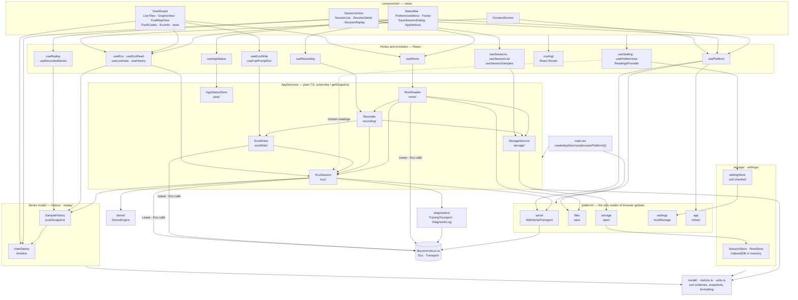
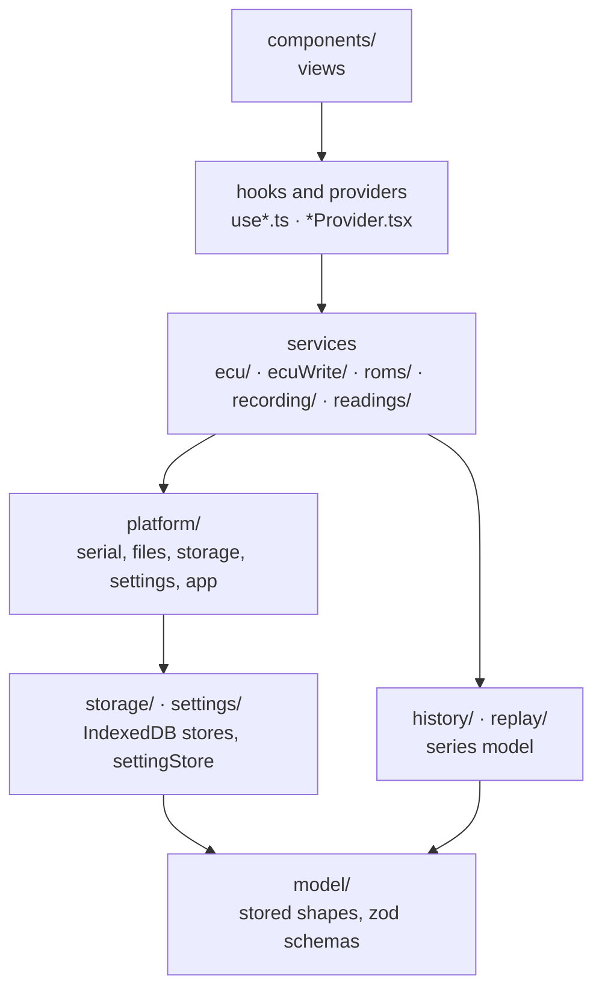
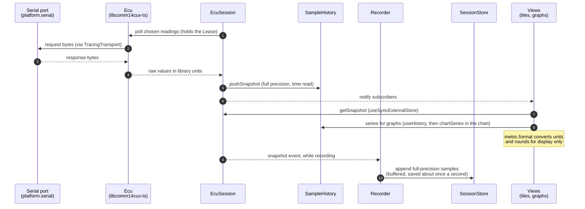

# Architecture

How 14CUX Gauge is put together after the #76–#81 refactors. The rules behind
it are in [AGENTS.md](../AGENTS.md#state-and-data).

## Structure

`main.tsx` builds the `Platform` and the `AppServices` once and hands them to
`<App>`. React providers only expose the services; views reach them through
hooks. Arrows point from the user of a module to the module it uses.

### Layers

A module never imports from a layer above its own; `eslint.config.js` enforces
the boundaries. As above, arrows point from a layer to the layers it may use.
`history/` and `replay/` (outside their hooks) use only `model/`, `metrics` and
`units`, so the series model sits below the services and views that read it.

## Live data flow

One polling pass, from the serial port to a tile, a graph and a recording.

ECU writes (clearing faults, actuator tests) go the other way: a view behind
`ConfirmDialog` calls `useEcuWrite`, which asks `EcuWrites`; `EcuWrites` takes
the `Lease` from `EcuSession`, calls the `Ecu` through it, keys the outcome by
`EcuLink`, and the `Recorder` logs it into the current session. `RomReader`
reads the ROM image the same way, through a `Lease` of its own.

Replay reads a stored session through `useSessionSamples`, and
`useRecordedSeries` builds a `SampleHistory` from it with `pushSnapshot`, as
`EcuSession` does live. The charts draw both with `chartSeries`, and `useReplay`
drives the shared timeline, so a gap or an extreme reads the same live and in
replay.
